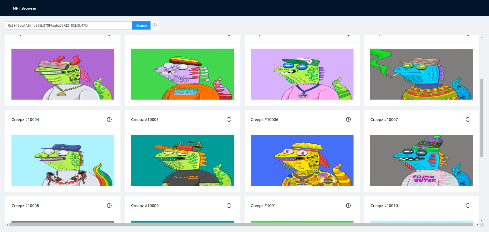

# NFT Browser

Welcome to the NFT Browser, a React-based web application that allows you to explore and interact with a diverse collection of Non-Fungible Tokens (NFTs).

## Try it out!
The link of the browser: [NFTbrowser](https://dev8099.dwf7gmjurwrq5.amplifyapp.com/)

## Features

- **Dynamic Search**: Leverage the power of React to dynamically filter through the NFT collections in real-time.
- **Curated Collections**: Discover handpicked NFTs grouped under "CENTURY" and "NimBuds" series.
- **Interactive Details**: Engage with the detail view of each NFT via an info icon, powered by React's state management.
- **Responsive Layout**: Experience a fully responsive web design that adapts to any screen size or device.

## Technologies

- **React**: Utilizes the latest React framework for efficient UI rendering and state management.
- **AWS Amplify**: Hosted on AWS Amplify for reliable access and high availability.

## Getting Started

To get a local copy up and running, follow these simple steps:

1. Clone the repository `git clone https://github.com/your-username/nft-browser.git`.
2. Navigate to the project directory `cd nft-browser`.
3. Install NPM packages `npm install`.
4. Run the app in development mode `npm start`.

